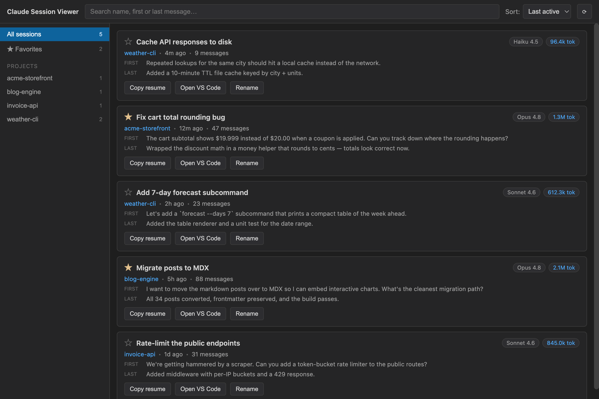

<div align="center">


# Claude Session Viewer

A small macOS desktop app to browse, search, and manage your local Claude Code sessions.

</div>



> The sessions shown above are sample data.

## What it does

Claude Code stores every session as a `.jsonl` file under `~/.claude/projects/`. This app
reads those files directly — there is no separate database and nothing is uploaded anywhere —
and gives you a fast UI on top of them:

- **Browse every session** grouped by project, with model, token count, message count, and
  the first/last message of each conversation.
- **Search** across session name, first message, and last message.
- **Sort** by last active or created date.
- **Rename** a session inline (writes an `ai-title` entry to the JSONL, exactly like
  `claude /rename`).
- **Copy resume command** — puts `claude --resume <id>` on your clipboard.
- **Open in VS Code** — opens the session's working directory.
- **Favorite** sessions with a star (persisted in the app's data directory).

It's a viewer/manager, not a conversation reader — see [`PLAN.md`](PLAN.md) for scope.

## Requirements

- **macOS** (the app is macOS-first; the VS Code launcher and packaging target macOS).
- **Node.js 18+** and npm.
- **Rust toolchain** via [rustup](https://rustup.rs/) — Tauri compiles a native Rust backend.
- Tauri's system prerequisites for macOS (Xcode Command Line Tools). See the
  [Tauri prerequisites guide](https://tauri.app/start/prerequisites/).

If `cargo` isn't on your PATH after installing rustup, run `. "$HOME/.cargo/env"` first.

## Getting started

```bash
# 1. Clone and enter the repo
git clone <repo-url>
cd claude-code-session-viewer

# 2. Install frontend dependencies
npm install

# 3. Run the app (compiles the Rust backend + serves the UI, hot-reloads both)
npm run app
```

`npm run app` is the command you want for day-to-day development — it opens the app in a
**native desktop window** with the Rust backend wired up and hot-reloads both Rust and the UI.
The first run downloads and compiles the Rust dependencies, so it takes a few minutes;
subsequent runs are fast.

> ⚠️ **Don't open `localhost:1420` in a browser.** That's the frontend-only Vite dev server
> (`npm run dev`); it has no Tauri backend, so every session load throws
> `Cannot read properties of undefined (reading 'invoke')`. Always use the native window from
> `npm run app`.

## Building a distributable app

```bash
npm run app:build
```

The bundled `.app` and installer land in `src-tauri/target/release/bundle/`. Double-click the
`.app` to run — no terminal needed.

## Scripts

| Command             | What it does                                                            |
| ------------------- | ---------------------------------------------------------------------- |
| `npm run app`       | **Run the full desktop app** with hot reload (use this for development). |
| `npm run app:build` | Produce the bundled `.app` / installer.                                 |
| `npm test`          | Run the frontend unit/component tests (Vitest).                         |
| `npm run typecheck` | TypeScript typecheck only (no build).                                   |
| `npm run build`     | TypeScript typecheck + Vite build of the frontend only (no Rust).       |
| `cd src-tauri && cargo test` | Run the Rust backend tests.                                   |

`npm run app` / `npm run app:build` are aliases for `npm run tauri dev` / `npm run tauri build`
— use whichever you prefer.

> `npm run dev` starts the Vite dev server alone (browser at `localhost:1420`). The app's IPC
> calls fail without the Tauri shell, so use `npm run app` for actual use.

## How it works

- **Backend** (`src-tauri/src/lib.rs`) — Rust. All filesystem access, JSONL parsing, and the
  Tauri IPC commands.
- **Frontend** (`src/`) — React 19 + TypeScript + Vite, styled with plain CSS (always dark,
  VS Code dark theme).

For the data flow, the exact JSONL session-file contract, and the IPC command surface, see
[`docs/ARCHITECTURE.md`](docs/ARCHITECTURE.md).

## A note on your data

This app reads and writes your **real** Claude Code session files in `~/.claude/projects/`.
Renaming a session appends to its `.jsonl` file (history is preserved, never rewritten);
favorites are stored separately in the app's data directory. Nothing leaves your machine.
